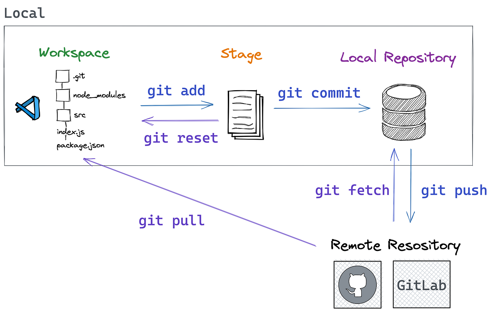

# Git

## git 구조도


## 파일 수정!!!

## 간단 사용법
1. add
     - 새로운 파일을 추가할 수 있습니다.
     - source tree를 사용할 경우 스테이지에 올리는 것이 add 하는 방법입니다.
     - 명령어
     ```
      // 작업한 파일을 추가하는 명령어
      $ git add [file]

      // 작업한 파일을 전체 추가하는 명령어
      $ git add .
     ```

2. commit
     - 스테이지에 추가(add)한 파일을 커밋하는 명령어입니다.
     - 소스트리를 사용할 경우, 메세지를 입력하는 란 아래의 '커밋' 버튼을 누르시면 됩니다.
     - 명령어
     ```
      // 커밋 명령어
      $ git commit -m "[message]"

      // 커밋 명령어
      $ git commit
      ```

3. push
     - 커밋한 파일을 원격 저장소에 올리는 명령어입니다.
     - 커밋 후 푸시까지 해야 원격 저장소에 적용됩니다.
     - 소스트리를 사용할 경우, 상단의 Push 버튼을 눌러 적용할 수도 있고, 커밋 버튼 옆에 '바뀐 내용 즉시 푸시' 체크박스를 체크한 뒤 커밋 버튼을 눌러 적용할 수도 있습니다.
     - 명령어
     ```
      // 푸시 명령어
      $ git push [remote] [branch]

      // 예시
      $ git push origin development
      ```


4. pull
     - 원격 저장소에 있는 내용을 가져오는 명령어입니다.
     - svn의 체크아웃과 같은 기능입니다.
     - 소스트리를 사용할 경우, 상단의 Pull 버튼을 눌러 적용할 수 있습니다.
     - 명령어
     ```
     // 풀 명령어
     $ git pull [remote] [branch]

     // 예시
     $ git pull origin development
     ```


5. merge
     - 여러 브랜치나 커밋을 하나로 통합하는 과정을 말합니다.
     - 소스트리를 사용할 경우, 상단의 병합 버튼을 눌러 적용할 수 있습니다.
     - 동일한 파일을 작업할 경우 충돌이 일어날 수 있습니다.
     - 충돌이 일어났을 경우, 충돌난 파일을 수정하고 커밋하면 충돌이 해결됩니다.


6. branch
     - 어떠한 작업을 할 때 독립적인 작업을 할 수 있도록 만드는 하나의 갈래입니다.
     - 기존 코드를 가져와 새로운 독립적인 공간을 만들어 코드를 저장할 수 있습니다.
     - 협업시, 본인의 기능에 따라 새로운 브랜치를 만들어 작업한 뒤 main 또는 develop 브랜치에 병합하는 방식을 추천드립니다.
     - 개발, 운영, 검증등으로 브랜치를 나눠 오류 수정이나 코드 추가시 단계별로 관리할 수 있습니다.
     - 소스트리를 사용할 경우, 상단의 브랜치 버튼을 눌러 브랜치를 관리할 수 있습니다.
     - 명령어
     ```
     // 브랜치 추가 명령어
     $ git branch [branch]

     // 브랜치 삭제 명령어
     $ git branch -d [branch]

     // 브랜치 변경 명령어
     $ git checkout [branch]

     // 예시
     $ git branch development
     ```

7. remote
     - 원격 저장소 정보(깃허브 주소)를 저장하는 공간입니다.
     - 기본적으로는 origin 이라는 이름의 원격 저장소를 사용합니다.
     - 소스트리를 사용할 경우에는 좌측의 '원격'탭을 이용해 추가하거나 삭제할 수 있습니다.
     - 명령어
     ```
     // 원격 저장소 추가 명령어
     $ git remote add [remote] [url]

     // 원격 저장소 삭제 명령어
     $ git remote rm [remote]

     // 예시
     $ git remote add origin https://github.com/JayainDevelopment/JaCloud.git
     ```

8. clone
     - 원격 저장소의 코드를 다운로드 받는 과정입니다.
     - 깃허브 저장소의 'Code' 버튼을 클릭하면 zip로도 받을 수 있고, https 주소를 복사하여 명령어나 소스트리를 통해 소스코드를 다운받을수도 있습니다.
     - 소스트리를 사용할 경우 
         1. 새로운 탭을 연 뒤, 상단 clone 버튼을 클릭합니다.
         2. URL을 입력할 수 있는 창에 깃허브 저장소의 url이나, code 버튼을 클릭했을 때 나오는 https 주소를 입력해줍니다.
         3. 목적지 경로 란에는 소스파일을 저장할 경로를 입력합니다.
         4. 이름 란에는 소스파일의 이름을 입력합니다.
         5. '클론'버튼을 누르시면 목적지 경로에 소스코드가 저장됩니다.
     - 명령어
     ```
     // 클론 명령어
     $ git clone [url] [path]

     // 예시
     $ git clone https://github.com/cdis001/react-instagram-clone2.git
     ```
     

9. pull request
     - 브랜치를 통합하기 전 검증하기 위한 과정입니다.
     - 브랜치를 사용하여 커밋했을 때 깃허브 상단의 'pull request' 탭을 선택하여 생성할 수 있습니다.
     - 소스의 변경 내역, 커밋 내역을 확인할 수 있습니다.

- 그 외의 git에 대한 기능은 아래의 링크에서 확인하실 수 있습니다.
     > https://backlog.com/git-tutorial/kr/

## 브랜치

1. main
     - 가장 기본이 되는 브랜치 입니다.
     - 이 브랜치는 전체 프로젝트의 시작점이며, 이 브랜치를 이용하여 전체 프로젝트를 진행합니다.
     - 서비스 배포용 브랜치라고 볼 수 있습니다.

2. develop
     - 개발용 브랜치 입니다.
     - 개발을 진행할 때 이 브랜치를 중심으로 작업을 진행합니다.

3. 기타
     - 그 외에 다른 브랜치들을 추가할 수 있습니다.
     - 다른 작업을 할 때 브랜치를 새로 만들어 작업할 수 있습니다.
