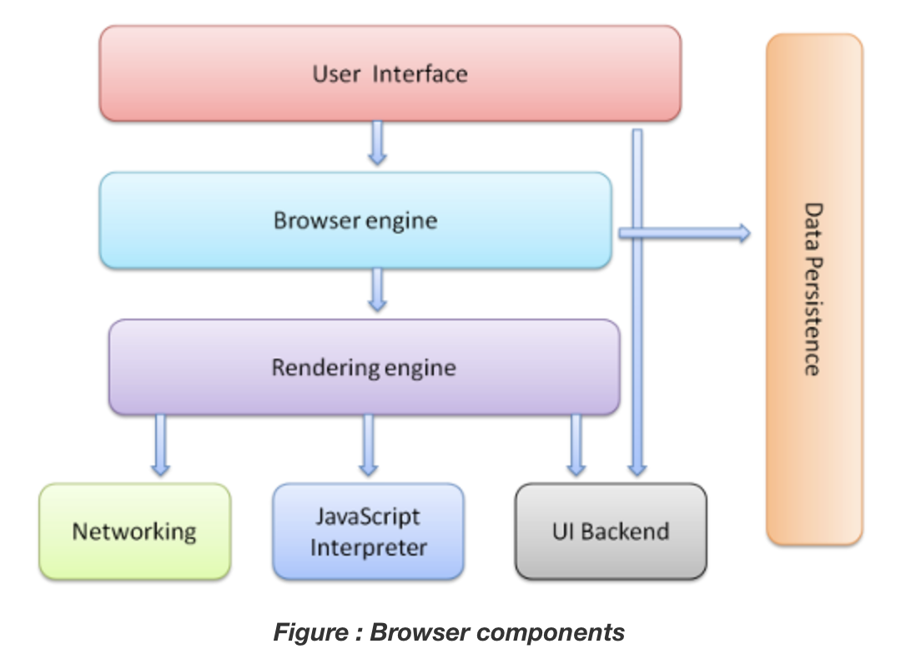

# Web Browser Structure
- 브라우저의 자세한 구조는 각 브라우저마다 다르므로, 이 글에서는 아주 기본적인 내용만 다룰 예정

## Browser Structure

### 1. User Interface
- 사용자 인터페이스
- 브라우저를 실행했을 때 보이는 화면
- 이와 같이 사용자와 상호작용 하는 화면을 UI라고 함

### 2. Browser engine
- 사용자 인터페이스와 렌더링 엔진 간의 상호작용을 관리
- 요청된 콘텐츠(웹 사이트)를 표시하는데 필요한 데이터를 렌더링 엔진에 제공하고, 사용자의 입력에 따라 페이지를 업데이트
- 웹 페이지의 내용을 검색하고 표시하는 역할
- 사용자가 주소 표시줄에 웹 주소를 입력하면 해당 웹 페이지의 HTML 및 CSS등을 가져와 렌더링하여 사용자에게 시각적으로 표시
- 웹 페이지에서 무언가(클릭, 드래그 등...)를 하면 브라우저 엔진에서 어떤 이벤트를 했는지 감지한 뒤 처리함

### 3. Rendering engine
- HTML 문서 및 스타일 시트와 같은 콘텐츠를 화면에 표시하는 역할
- 즉, 브라우저 엔진이 HTML, CSS, JS를 가져오면 -> 랜더링 엔진이 엮어서 보여줌
- 클릭했을 때 브라우저에서 일어나는 과정
    1. 웹 페이지에서 '클릭'이라는 이벤트가 발생
    2. 브라우저 엔진에서 '클릭' 이벤트를 감지
    3. 브라우저 엔진이 해당 이벤트에 대한 자바스크립트 이벤트 함수를 실행
        - 위 이벤트는 5번의 자바스크립트 해석기에서 가져옴
        - 어떠한 이벤트(클릭, 입력, 드래그...)가 발생했을 때 실행하는 함수를 이벤트 핸들러라고 정의함
    4. 이벤트 핸들러가 실행된 뒤에 화면이 변경될 경우, 렌더링 엔진이 변경된 내용을 감지하고 새로 반영함

### 4. Networking
- HTTP 요청과 같은 네트워크 작업을 수행함

### 5. JavaScript Interpreter
- 자바스크립트 해석기
- JavaScript 코드를 해석하고 실행하는 해석기
- 웹 페이지의 동적인 부분을 처리
- 브라우저마다 고유한 엔진이 따로 있음

### 6. UI Backend
- 콤보박스, 윈도우 등 개발자가 직접 만들지는 않았지만 브라우저가 이미 갖고 있는 UI들을 그려주는 역할
- 브라우저가 동작하고 있는 운영체제의 인터페이스에 따라 UI를 처리
- 웹 브라우저의 기본적인 창 요소를 그리고 관리하는 역할
- 플랫폼별로 다양한 그래픽 인터페이스를 사용하여 창, 버튼, 텍스트 상자 등을 생성

### 7. Data Persistence
- 데이터 저장소
- 브라우저에서 사용하는 데이터를 저장하는 장소
- 쿠키, 세션, IndexedDB 등 여러 데이터 저장소가 있음