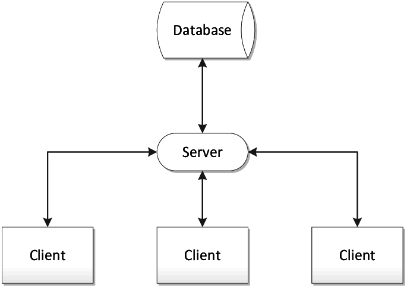
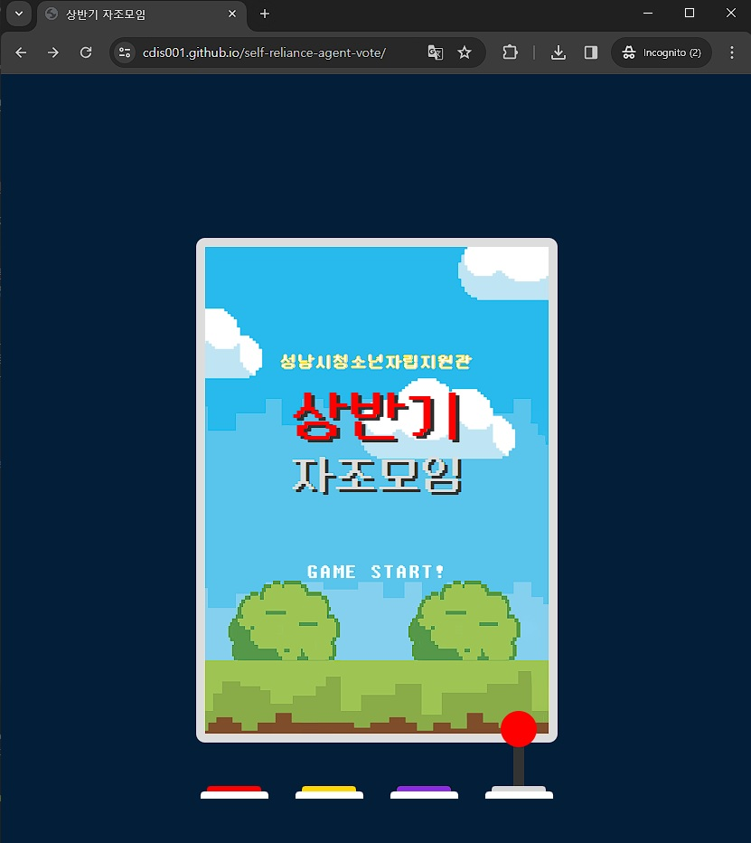
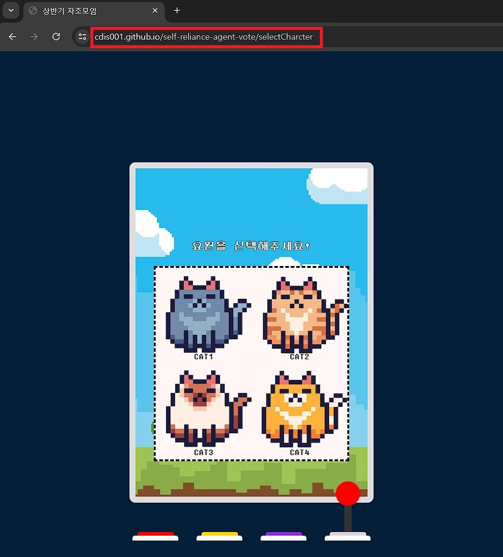
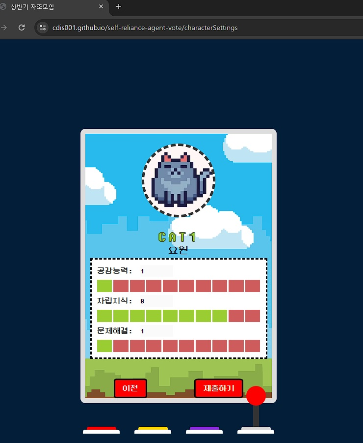
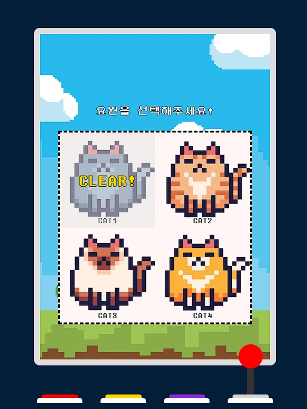

# Web Site Structure


## Client
- 특정 서비스를 이용하는 사용자(고객)
- 웹사이트의 클라이언트는 웹 브라우저
- 서버에서 받아온 데이터를 단말기 화면에 표시하고 사용자의 요청을 서버에 전달하는 역할을 함
    - 서버에서 받아온 데이터를 브라우저에 표시하는 것을 랜더링이라 함
    - [랜더링?](./rendering.md)
- 사용자와의 의사소통을 하는 부분
- 웹 클라이언트 개발을 한다는 것은 프론트엔드 개발
- 대부분의 로직 및 UI 렌더링은 클라이언트 측에서 이루어짐

## Server
- 클라이언트에게 네트워크를 통해 정보나 서비스를 제공하는 시스템
- 클라이언트와 통신하기 위해 HTTP 프로토콜을 사용
- 필요에 따라 데이터베이스와 상호 작용하여 데이터를 클라이언트에 전송

## Database
- 데이터를 저장, 관리하고 필요에 따라 데이터를 검색, 수정, 삭제하는 역할을 하는 시스템

### 요원 투표 페이지로 보는 Client-Server-Database의 관계
1. Client
    -  
        - 위의 "GAME START!" 버튼을 누를 경우 웹 페이지 URL이 바뀌면서, 서버에 새로운 페이지를 요청
            - 사실 이는 랜더링 방식에 따라 다른데, 해당 프로젝트는 CSR 형식으로 개발되어 있으나 편의를 위해 SSR 방식으로 설명
            - 실제로는 이미 받아놓은 웹 페이지들을 URL에 맞춰서 브라우저 화면에 보여줌
            - 차이점은 SSR 방식의 경우에는 새로운 URL로 변경할 때마다 서버에 요청하지만, CSR 방식의 경우에는 서버에 요청하지 않고 미리 받아놓은 데이터를 보여주는 차이
            - 외부에서 가져오느냐, 내부에 있는걸 꺼내 쓰느냐의 차이
2. Server
    - 
        - 위와 같은 원리로 캐릭터에 스탯을 부여하는 페이지로 이동
        - 집착, 귀여움, 공감능력...등의 스탯을 선택한 뒤 "제출하기" 버튼 클릭시 선택한 스탯 정보와 함께 서버에 전송
            - 전달하는 서버 URL(자원)
                ```javascript
                `https://${서버 DNS 주소}/stat/${characterData.id}`
                ```
            - 전달하는 HTTP Method(행위)
                - POST 요청
                - 새로운 스탯 정보를 추가하는 행위이므로, POST 요청 사용
            - 전달하는 스탯의 정보(표현)
                ```json
                [
                    {
                    "id": 1,
                    "title": "집착",
                    "value": 10,
                    },
                    {
                    "id": 2,
                    "title": "꼰대력",
                    "value": 10,
                    },
                    {
                    "id": 3,
                    "title": "귀여움",
                    "value": 10,
                    },
                    {
                    "id": 4,
                    "title": "공감능력",
                    "value": 1,
                    },
                    {
                    "id": 5,
                    "title": "자립지식",
                    "value": 8,
                    },
                    {
                    "id": 6,
                    "title": "문제해결",
                    "value": 1,
                    },
                ]
                ```
                - JSON 형식으로 전달
        - 해당 정보를 바탕으로, DB에 있는 어떤 데이터를 어떻게 해야할지 분석
            - stats 라는 데이터베이스 항목에 전달 받은 데이터를 저장

3. DataBase
    - 서버에서 stats에 전달 받은 데이터를 추가

4. Server
    - 데이터베이스에 데이터를 저장 후 성공인지 실패인지 구별하여 HTTP 상태 코드를 사용하여 클라이언트에게 전달
    - HTTP 상태 코드
        - 200번대
            - 요청 성공
        - 300번대
            - 리다이렉션
            - 요청이 완수되기 위해 추가적인 행동 필요
            - 잘 사용하진 않음
        - 400번대
            - 클라이언트 오류
        - 500번대 
            - 서버 오류
        > https://developer.mozilla.org/ko/docs/Web/HTTP/Status
        - 자세한 사항은 위 링크에서 알아서 봐라

5. Client
    - 
        - 4번의 서버에서 받아온 응답으로 성공 or 실패를 구별
            - 성공했을 경우, 위 사진처럼 해당 요원의 정보가 제출되었음을 보여줌
            - 실패했을 경우, 제출이 실패했다는 알림이 뜸
        - 위 내용은 코드를 어떻게 짜느냐에 따라 수정 가능

### MVC 패턴
- 데이터베이스-서버-클라이언트 구조를 이용한 다양한 패턴이 있는데, 가장 대표적인 MVC 패턴에 대해 알아보자
- MVC 패턴은 Model, View, Controller로 이루어진 웹 사이트를 구성하여 개발하는 방법
- Model
    - 데이터베이스에 저장된 데이터를 가져오거나 저장하는 등의 역할을 수행함
    - 요원 투표 페이지로 보는 Client-Server-Database의 관계에서 2번 -(Model)-> 3번을 수행하는 과정
- View
    - 사용자가 보는 화면
    - Client
- Controller
    - 사용자의 입력을 처리하고, 모델과 뷰 사이에서 데이터를 주고 받는 역할
    - 요원 투표 페이지로 보는 Client-Server-Database의 관계에서 
        - 1번의 URL이 변경될 경우 새로운 화면을 보여주기 위한 역할
            - 사실 해당 프로젝트는 랜더링 방식이 CSR이라 해당 역할은 수행하지 않음
        - 1번 -(Controller)-> 2번 수행
            - 사용자의 입력을 모델(데이터베이스)에 전달하는 역할
        - 4번 -(Controller)-> 5번 수행
            - 변경된 사항을 사용자에게 알리는 역할