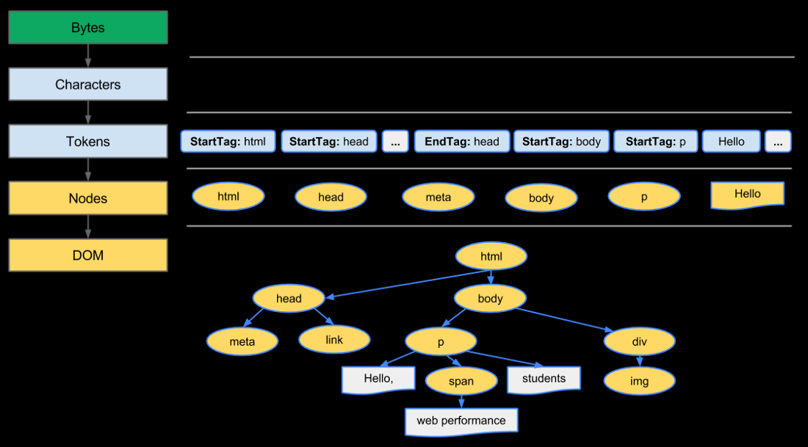
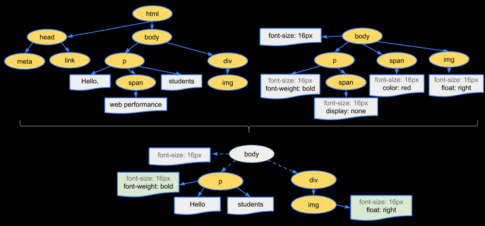

# Web Rendering
- HTML,CSS, 자바스크립트 등 개발자가 작성한 문서가 브라우저에서 출력되는 과정
- 브라우저는 렌더링을 수행하는 렌더링 엔진을 가지고 있음
    - 크롬: Blink
    - 사파리: Webkit
    - 파이어폭스: Gecko
- 브라우저가 페이지를 렌더링 하려면 DOM 트리를 생성해야 함
    - HTML 코드는 DOM, CSS는 CSSOM 트리를 생성

## CRP(Critical Rendering Path)

- 렌더링 엔진이 렌더링 할 때 사용하는 프로세스
- Critical Rendering Path를 진행하는 과정을 DevTools로 확인 할 수 있음(Chrome에서는 DevTools의 Performance에서 확인 할 수 있다)
- 해당 과정 정보를 바탕으로 최적화 가능
- 아래의 단계들로 구성
1. DOM(Document Object Model) Tree 생성
    
    
    
    1. 변환 : 브라우저가 HTML의 원시 바이트를 읽어와서, HTML에 정의된 인코딩(예: UTF-8)에 따라 개별 문자로 변환
    2. 토큰화 : 브라우저가 문자열을 W3C 표준에 지정된 고유 토큰으로 변환
    3. 렉싱 : 방출된 토큰은 해당 속성 및 규칙을 정의하는 “객체”로 변환
    4. DOM 생성 : 마지막으로 HTML 마크업에 정의된 여러 태그 간의 관계를 해석해서 트리 구조로 연결
    - 브라우저는 HTML 마크업을 처리 할 때 마다 위의 모든 단계를 수행
2. CSSOM(CSS Object Model) 트리 생성
    - DOM 트리를 생성하는 과정과 동일한 과정으로 CSSOM 트리를 생성
    - 외부(external) css 파일에 정의된 스타일과 style 태그에 작성된 스타일을 브라우저가 이해하고 처리할 수 있는 형식으로 변환해야 함
3. Javascript 실행
    - JavaScript는 파서 차단 리소스(parser blocking resource)로 간주된다. 즉, HTML 문서 자체의 구문 분석은 JavaScript에 의해 차단
    - 파서가 내부 태그이든 외부 태그이든 `<script>` 태그에 도달하면 (외부 태그 인 경우) fetch를 중단하고 실행
    - 따라서 문서 내의 요소를 참조하는 JavaScript 파일이 있는 경우 해당 문서가 표시된 후에 배치 해야함
    - JavaScript가 파서 차단(parser blocking)되는 것을 피하기 위해 `async` 속성을 적용하여 비동기적으로 로드할 수 있음
4. 랜더링 트리(Rendering Tree) 생성
    - DOM 트리와 CSSOM 트리가 만들어지면, 이 둘을 결합해서 렌더링 트리를 생성
    - 렌더링 트리에는 페이지를 렌더링 하는데 필요한 노드만 포함
    - 표시되는 내용만 캡쳐하가 때문에 `display:none`을 사용하여 CSS로 숨겨진 요소는 포함하지 않음
    
    
    
5. 레이아웃(Layout)
    - 뷰포트 내에서 각 요소의 정확한 위치와 크기를 정확하게 캡처하는 Box 모델이 출력
    - 모든 상대적인 측정값은 화면에서 절대적인 픽셀로 변환
    - 뷰포트 크기는 문서 헤드에 제공된 메타 뷰포트 태그에 의해 결정되거나, 태그가 제공되지 않으면 기본 뷰포트 너비 인 980px가 사용
6. 페인팅(Painting)
    - 페이지의 가시적인 내용을 픽셀로 변환하여 화면에 표시
    - 렌더링 트리의 각 노드를 화면의 실제 픽셀로 변환
    - 레이아웃 단계에서 모든 계산이 완료가 되면, 화면에 요소들을 그림
    - 이 단계를 “페인팅” 또는 “래스터화”라고 함
    - 레이아웃 단계에서 각 노드들이 위치, 크기, 색상 등 스타일이 모두 계산이 되었기 때문에 화면에 실제 픽셀로 변환
7. 리플로우(Reflow), 리페인트(Repaint)
    - 사용자가 웹 페이지에 처음 접속을 하면, 렌더링 과정을 거쳐서 화면에 모든 요소가 그려지게 됨
    - 이후에 사용자는 다양한 액션을 수행하게 되고, 여기서 발생되는 이벤트로 인해서 새로운 HTML 요소가 추가되거나, 기존 요소의 스타일이 바뀌거나 하는 변경이 일어남
    - 이런 변경을 통해 영향을 받게되는 모든 노드에 대해서 렌더링 트리 생성과 레이아웃 과정을 다시 수행해야 하는데, 이러한 과정을 리플로우(Reflow)라고 함
    - 리플로우는 단지 변경사항을 반영하기 위해서 렌더링 트리를 생성하고 레이아웃 과정을 다시 수행하는 것
    - 실제 이 결과를 화면에 그려지기 위해서는 다시 페인팅 단계를 수행해야 함
    - 이 과정을 리페인트(Repaint)라 함
    - 기존 요소에 변경 사항이 생겼다고 해서 항상 리플로우(Reflow)-리페인트(Repaint)가 일어나는 것은 아니고, 레이아웃에 영향이 미치지 않는 단순한 색상 변경 같은 변경사항은 리플로우(Reflow) 수행 없이 바로 리페인트(Repaint)만 수행함
        - 단, 리플로우가 일어나면 반드시 리페인트가 일어남

### SSG
- build 시 고정된 데이터들을 모두 담은 정적 html 파일을 생성하여 재활용
- 브라우저는 HTML을 다운로드하고 최종 사용자가 사이트를 볼 수 있도록 한다
- pre-render에 필요한 페이지의 개수만큼 정적파일이 생성됨
- 장점
    - 빠른 랜더링 속도
    - 불필요한 통신과 리렌더링 감소
- 단점
    - 많은 수의 페이지가 생성되거나, 데이터가 자주 업데이트되는 페이지에는 적합하지 않음

### SSR
- 페이지를 요청하면 서버에서 뷰 구성에 필요한 전체 HTML을 만들어 제공
- 과거의 static site으로 다시 돌아간 SSR 방식
- 클라이언트에서 화면을 구성하는 CSR과 달리 SSR은 서버에서 html을 만들어 제공
- 장점
    - 모든 내용이 html에 담겨져있으므로 SEO 대응이 가능
- 단점
    - 데이터가 채워진 html 문서를 화면에 띄운 다음 JS를 다운받기 때문에 렌더링과 동시에 인터렉션할 수는 없음
    - 요청마다 서버로부터 문서를 받아오기 때문에 상대적으로 과부하에 걸리기 쉬움

### CSR
- 유저가 접속했을때 모든 페이지를 랜더링 한 뒤 JS파일을 서버로부터 다운로드 받은 다음 필요한 데이터가 있으면 요청을 보내 가져옴
- 동적 html을 생성해 사용자에게 화면을 보여줌
- 클라이언트에서 필요한 페이지들을 미리 준비해둔 뒤 요청을 받을 경우에 완성 파일을 반환하는 방식
- 장점
    - 랜더링 이후엔 부드러운 사용자 경험 가능(화면 깜빡임 없음)
    - JS 사용이 가능한 동적 html을 생성해 보여주기 때문에 화면이 보여지고 사용자는 바로 인터렉션이 가능
- 단점
    - 초기 랜더링이 느림
    - 번들 사이즈가 커질수록 로딩 속도가 느려짐(tree-shaking과 code-splitting을 신경써야 함)
    - 요청이 들어온 뒤 html을 생성하는 방식이므로 SEO 대응이 어려움